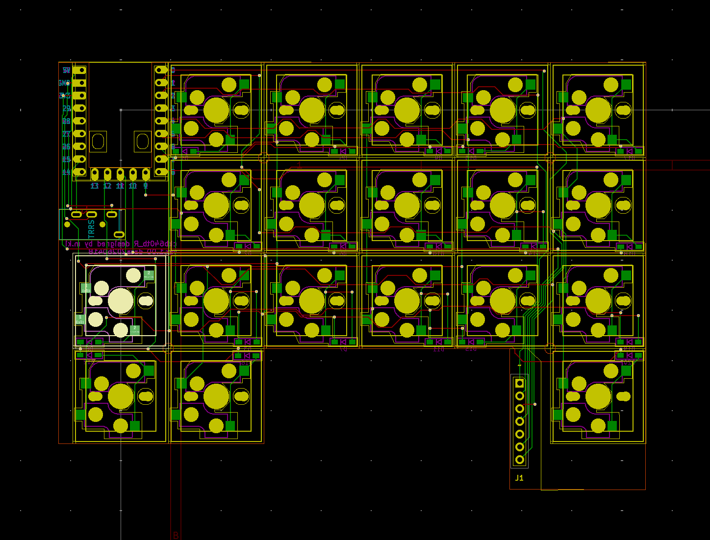
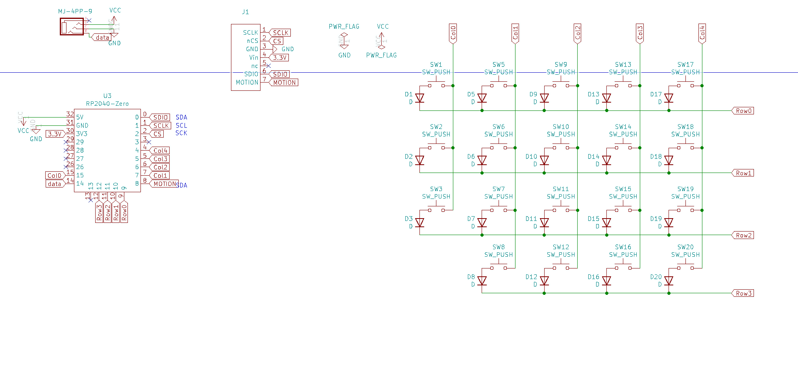

# ckb640tb

# Waht is ckb640tb

ckb640tb is 40%,ortho,splite keyboards with trackball.
 
ckb640tb use RP2040-Zero,run qmk_firmware.
 

# kicad

# BOM

<b>common parts</b>
| No. | Patrs | Quantity | remarks | Suppliers | Cost |
|--|--|--|--|--|--|
|番号|名前|数|備考|調達先|参考価格（送料込）| 
|1|PCB|3|左右およびトラックボールセンサー用|[JLCPCB](https://jlcpcb.com)|| 
|2|Switch plate|2|chocまたはcherry MX用|3D Print||
|3|Bottom case|2|chocまたはcherry MX用|3D Print||
|4|trackball case|1|3D Print|||
|5|Diode ダイオード|41|SMD|[遊舎工房](https://yushakobo.jp) [Talp Keyboard](https://talpkeyboard.net) [Daily Craft Keyboard](https://shop.dailycraft.jp)等|100個で220円程度から|
|6a|Swith socket スイッチソケット|40|choc|[遊舎工房](https://yushakobo.jp) [Talp Keyboard](https://talpkeyboard.net) [Daily Craft Keyboard](https://shop.dailycraft.jp)等|10個で165円程度|
|6b|Swith socket スイッチソケット|40|cherry MX|[遊舎工房](https://yushakobo.jp) [Talp Keyboard](https://talpkeyboard.net) [Daily Craft Keyboard](https://shop.dailycraft.jp)等|10個で165円程度|
|7|RP2040-Zero|2|MCU Board|[Talp keyboard](https://shop.talpkeyboard.com/products/rp2040-zero-usb-c-compatible)[Waveshare](https://www.waveshare.com/rp2040-zero.htm)|400円ぐらい|
|8|pmw3610|1|trackball senser|[Talp Keyboard](https://talpkeyboard.net)|800円程度|
|9-1|Rotaly encoder|1|EC12|[遊舎工房](https://yushakobo.jp)|330円程度|
|9-2|水平Rotaly encoder|1|CKW12|[遊舎工房](https://shop.yushakobo.jp/products/ckw12?_pos=1&_sid=10535dcd8&_ss=r)|1430円|
|10|Screw ネジ|13|なべこねじM2 6mm|[遊舎工房](https://shop.yushakobo.jp/products/a0800s2?variant=37665432535201)|50本880円
|11|Nut ナット|10|M2ネジに付属していることが多い|[ヒロスギネット](https://www.hirosugi-net.co.jp/shop/c/c221010/)|1個26円|
|12|Keycap キーキャップ|40|1U、chocの場合はロープロが最適|[遊舎工房](https://yushakobo.jp) [Talp Keyboard](https://talpkeyboard.net) [Daily Craft Keyboard](https://shop.dailycraft.jp)||
|13|Trackball トラックボール|1|25mm|[amazon](https://www.amazon.co.jp/エレコム-トラックボール用交換ボール-M-RT1DRBK-M-RT1BRXBKレッド-M-B25RD/dp/B0D4DYH8XY/ref=sr_1_1_pp?crid=T79Z54WF3EA3&dib=eyJ2IjoiMSJ9.7e1m5Nvhz2OQyDgK9OTI5WqhI75m91yj0DxbSvvTHPQudXna7x7PV2V7Ltm28gCztfiygmIhMrscxwhsIqDdmN4V3_dlFYAnxnpkE5Hxji5reoUpq8-GGLmtk-RkAzhl-g6neM7gr8e6XAF0dU58gfjoXiXPe7FqaaCTTVgWnSc9DumNBO6gnzu40q8PEfZFXIr4STHMi3mFfrhLWbS0GJfI5Hkq_PDijim50EpyBEgfnC6NL7fSwJjTqZw0-EHVLl1f6gY5sDU0OeXVJ9-kw4s2yEgio6in8A1hQaQCNOg.YaySIhCrwMmKsNCUQG_97WoYRyoTgLP1GyRtxr8EqXo&dib_tag=se&keywords=25mm%2Bトラックボール&qid=1777269545&sprefix=25mm%2Caps%2C278&sr=8-1&th=1)||
|14|Bearing ベアリング|3|外径5mm、内径2mm、幅2.5mm|[amazon](https://www.amazon.co.jp/dp/B0CV7XLDYP?ref=ppx_yo2ov_dt_b_fed_asin_title&th=1)||
|15|TRRS Jack|2||[遊舎工房](https://shop.yushakobo.jp/products/a0800tr-01-1?_pos=1&_sid=9ea2ad868&_ss=r) [Talp keyboard](https://shop.talpkeyboard.com/products/35mm-4-trrs-vonnector-2pcs)|１個55円程度|
|16|コンスルー|3|2mm　20ピン|[遊舎工房](https://shop.yushakobo.jp/products/31?variant=40815837610145)|385円|

 

In addition, USB cable, etc. are required.
 
この他に、TRRSケーブルやUSBケーブル等が必要です。
 

 

# license

[CC BY-NC-SA](https://creativecommons.org/licenses/by-nc-sa/4.0/deed.ja)

